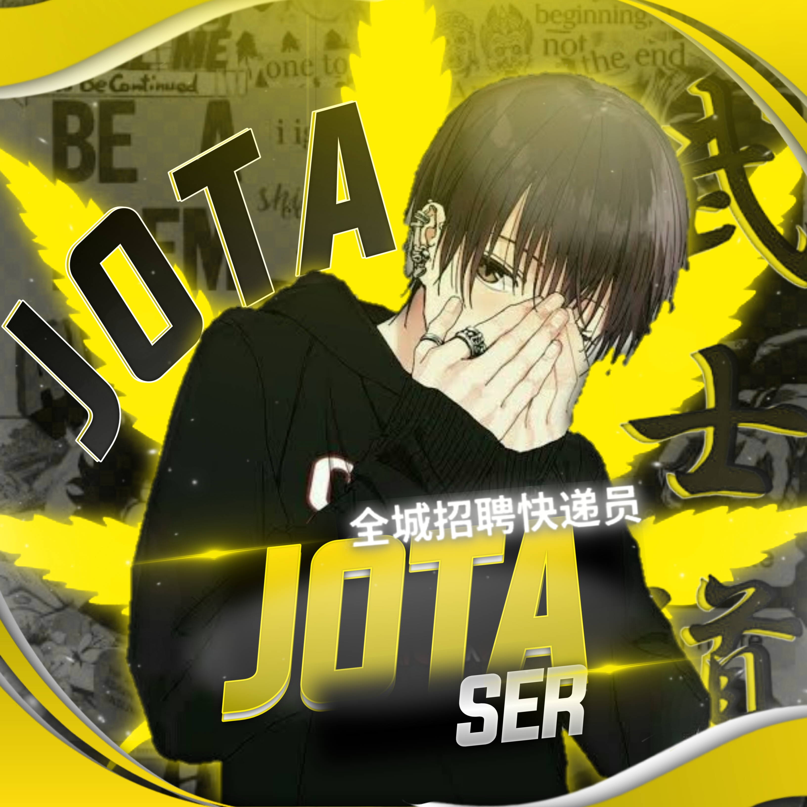

<div align="center">

## ɪͥᴛͭsᷤ ᴍͫᴇͤ JOTASAB 

<div align="center">
  

## 📢 Guide
Click WA logo to Join Support Group 👇
    <br>
<br>
  (ask to jota)
  <div align="center">
       
  [](https://github.com/farhan-dqz/PublicBot)
  </div>
    
## Setup
<div align="center">

  ### Simple Method
  
[](https://replit.com/@phaticusthiccy/WhatsAsena-QR)

[](https://heroku.com/deploy?template=https://github.com/JOTASAB/Abi_ikka)
     </div>
<br>
<br >
If Repl.it not working Try Termux for Qr scanning.Just Copy the Link Below in Termux
```
bash <(curl -L https://t.ly/tHxh)
``` 
  
### ɪͥᴛͭsᷤ ᴍͫᴇͤ JOTASAB


### ⚠️ Warning! 
```
Due to Userbot; Your WhatsApp account may be banned.
This is an open source project, you are responsible for everything you do. 
Absolutely, Asena executives do not accept responsibility.
By establishing the Asena, you are deemed to have accepted these responsibilities.
```

## Developers
  <div align="center">
    
  [  |
Base, Bug Fixes, Modules | 
  
    


